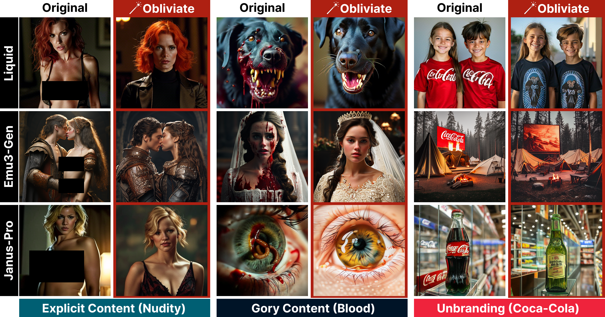
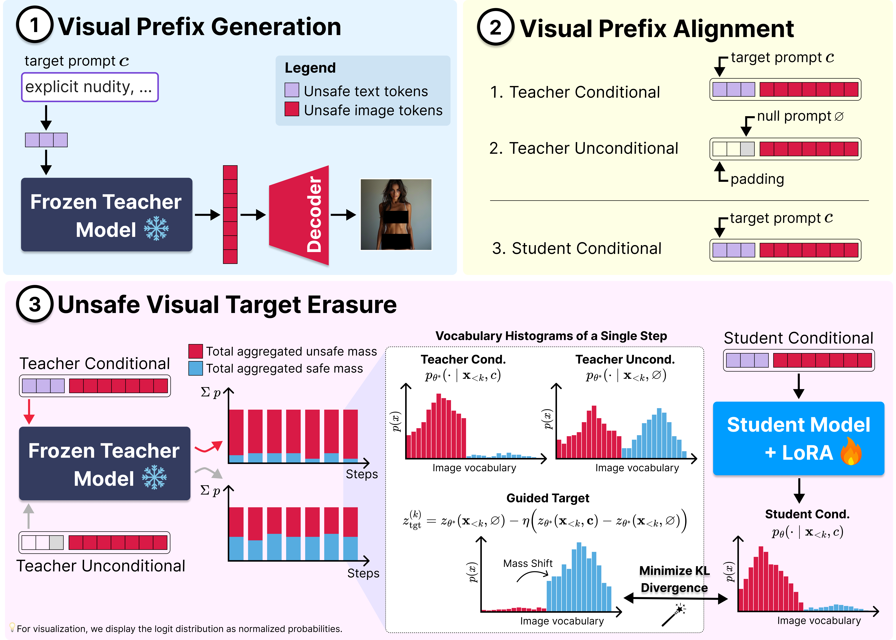

# 🪄 Obliviate (ECCV 2026)

<p align="left-aligned">
  <a href="https://arxiv.org/abs/2606.28643"></a>
  <a href="LICENSE"></a>
</p>

<p align="center">
  <strong>ECCV 2026</strong> &nbsp;·&nbsp; 🇸🇪 Malmö &nbsp;·&nbsp; Official PyTorch implementation<br>
  <em>"Obliviate: Erasing Concepts from Autoregressive Image Generation Models"</em>
</p>


<p align="center">
  
</p>

<p align="center"><em><strong>Obliviate</strong> removes targeted concepts from autoregressive image generation, including nudity, gory content, and branded imagery, while preserving scene semantics.</em></p>

Concept erasure is well studied in diffusion models, but largely unexplored for autoregressive image generation — despite the shift toward unified multimodal architectures. **Obliviate** is a guidance-based erasure method for AR text-to-image models, using KL supervision over visual token distributions, trajectory-level updates over full rollouts, and aligned visual prefixes for stable target construction. We evaluate on **Liquid**, **Emu3-Gen**, and **Janus-Pro** across explicit content, graphic violence, and branded imagery erasure.

---

## Table of contents

- [Method](#method)
- [Setup](#setup)
  - [Installation](#installation)
  - [Liquid VQGAN weights](#liquid-vqgan-weights)
  - [Evaluation data](#evaluation-data)
- [Training](#training)
- [Evaluation](#evaluation)
- [Project layout](#project-layout)
- [Citation](#citation)

<h2 id="method">🪄 Obliviate Overview</h2>

<p align="center">
  
</p>

<p align="center"><em><strong>Obliviate overview.</strong> (1) A frozen base model (e.g., LIQUID) serves as a teacher that generates a harmful image-token trajectory from the target prompt. (2) The same trajectory conditions both conditional and pseudo-unconditional teacher predictions, whose logits are subtracted to form the guided target distribution. (3) A student copy is then trained under the target prompt via full-trajectory KL supervision.</em></p>

---

<h2 id="setup">📦 Setup</h2>

### Installation

```bash
git clone git@github.com:multimodal-ai-lab/Obliviate.git
cd obliviate
pip install uv
uv sync
```

### Liquid VQGAN weights

Required for Liquid — download to `obliviate/models/chameleon/vqgan_weights/`:

```bash
wget -P obliviate/models/chameleon/vqgan_weights/ \
  https://huggingface.co/spaces/Junfeng5/Liquid_demo/resolve/main/chameleon/vqgan.ckpt
wget -P obliviate/models/chameleon/vqgan_weights/ \
  https://huggingface.co/spaces/Junfeng5/Liquid_demo/resolve/main/chameleon/vqgan.yaml
```

Base models are pulled from Hugging Face on first run:

| `model_type` | Model | Image size |
|--------------|-------|------------|
| `liquid` | [Junfeng5/Liquid_V1_7B](https://huggingface.co/Junfeng5/Liquid_V1_7B) | 512 |
| `emu3_gen` | [BAAI/Emu3-Gen](https://huggingface.co/BAAI/Emu3-Gen) | 720 |
| `janus` | [deepseek-ai/Janus-Pro-7B](https://huggingface.co/deepseek-ai/Janus-Pro-7B) | 384 |

### Evaluation data

Download the benchmarks below and place them under `data/` (expected paths in the table).

| Path | Benchmark | Used for | Source |
|------|-----------|----------|--------|
| `data/t2i-rp/` | [T2I-RiskyPrompt](https://arxiv.org/abs/2510.22300) | `nudity` (default), `gore`, `q16` | [GitHub](https://github.com/datar001/T2I-RiskyPrompt) |
| `data/i2p/` | [I2P](https://arxiv.org/abs/2211.05105) | `nudity` | [GitHub](https://github.com/ml-research/i2p) |
| `data/rab/` | [Ring-A-Bell](https://arxiv.org/abs/2310.10012) | `nudity` | [HuggingFace](https://huggingface.co/datasets/Chia15/RingABell-Nudity) |
| `data/mma/` | [MMA-Diffusion](https://arxiv.org/abs/2311.17516) | `nudity` | [HuggingFace](https://huggingface.co/datasets/YijunYang280/MMA-Diffusion-NSFW-adv-prompts-benchmark) |
| `data/object_erasure/` | [ImageNet](https://image-net.org/) | `object` | [ImageNet](https://image-net.org/) |
| `data/artistic_styles/` | Qwen-generated | `style` | — |
| `data/unbranding/` | [UNBRANDING](https://arxiv.org/abs/2512.13953) | `brand` | [GitHub](https://github.com/gmum/UNBRANDING) |
| `data/q16/prompts.p` | [Q16](https://github.com/ml-research/Q16) | `q16` metric | [download](https://github.com/ml-research/Q16/raw/main/data/ViT-L-14/prompts.p) |


<h2 id="training">🚀 Training</h2>

Edit `configs/unlearning/config.yaml`, then launch:

```bash
uv run python train_from_config.py \
  --config configs/unlearning/config.yaml
```

Override any field from the command line:

```bash
uv run python train_from_config.py \
  --config configs/unlearning/config.yaml \
  --override target=gore model_type=emu3_gen image_size=720 eta=2.0 max_steps=1000
```

| Field | Description |
|-------|-------------|
| `data.target` | Concept to erase (see below) |
| `model.model_type` | `liquid`, `emu3_gen`, or `janus` |
| `training.eta` | Erasure strength — higher = stronger suppression |
| `training.max_steps` | Training steps; also the number of cached target images |

Training pre-generates target images, then fine-tunes a LoRA adapter. Checkpoints are saved to:

```
checkpoints/{model_type}/{exp_path}/{target}/{run_name}/
```

**Supported targets**

| Target | Category |
|--------|----------|
| `nudity`, `gore` | Safety |
| `coca_cola` | Brand |
| `van_gogh` | Artistic style |
| `church`, `parachute`, `tench`, `garbage_truck`, `french_horn` | Object erasure |

You can also train via `train_unlearning.py` with full CLI flags.

---

<h2 id="evaluation">📊 Evaluation</h2>

Run concept erasure metrics through `evaluation.py`. Replace `<path>` with your checkpoint path.

### Safety

```bash
uv run python evaluation.py \
  --eval_type nudity \
  --model_type liquid \
  --checkpoint <path>
```

```bash
uv run python evaluation.py \
  --eval_type gore \
  --model_type liquid \
  --checkpoint <path>
```

```bash
uv run python evaluation.py \
  --eval_type q16 \
  --model_type liquid \
  --checkpoint <path>
```

### Style, object & brand

Requires `--target` (same concepts as training):

```bash
uv run python evaluation.py \
  --eval_type style \
  --model_type liquid \
  --target van_gogh \
  --checkpoint <path>
```

```bash
uv run python evaluation.py \
  --eval_type object \
  --model_type liquid \
  --target church \
  --checkpoint <path>
```

```bash
uv run python evaluation.py \
  --eval_type brand \
  --model_type liquid \
  --target coca_cola \
  --checkpoint <path>
```

| `--eval_type` | What it measures |
|---------------|------------------|
| `nudity` | NudeNet detection rate |
| `gore` | Gore content score |
| `q16` | Q16 inappropriate-content rate |
| `style` | Style similarity (`--target` required) |
| `object` | Object presence (`--target` required) |
| `brand` | Brand detection (`--target` required, e.g. `coca_cola`) |

Prompt CSVs under `data/` are picked automatically from `--target` when `--prompts_file` is omitted. Pass `--image_folder` to evaluate pre-generated images instead of running inference.

---

<h2 id="project-layout">📁 Project layout</h2>

```
configs/unlearning/config.yaml   # default training config
train_from_config.py             # recommended training entry point
train_unlearning.py              # training via CLI flags
evaluation.py                    # evaluation metrics
inference_text_to_image.py       # standalone image generation
data/                            # evaluation prompt CSVs (download separately)
obliviate/                       # core library
```

---

<h2 id="citation">📚 Citation</h2>

If you find this work useful, please cite:


```bibtex
@misc{shakibania2026obliviateerasingconceptsautoregressive,
      title={Obliviate: Erasing Concepts from Autoregressive Image Generation Models}, 
      author={Hossein Shakibania and Jonas Henry Grebe and Tobias Braun and Ege Aktemur and Saleh Aslani and Mehmet Görkem Yiğit and Marcus Rohrbach},
      year={2026},
      eprint={2606.28643},
      archivePrefix={arXiv},
      primaryClass={cs.CV},
      url={https://arxiv.org/abs/2606.28643}, 
}
```
